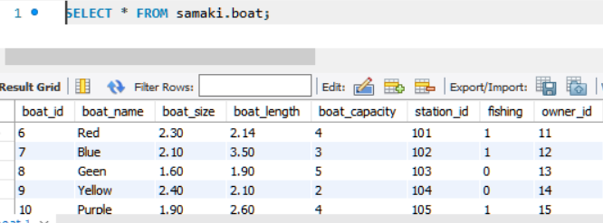
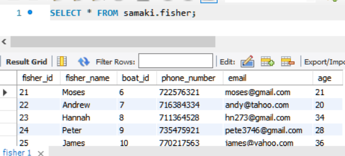
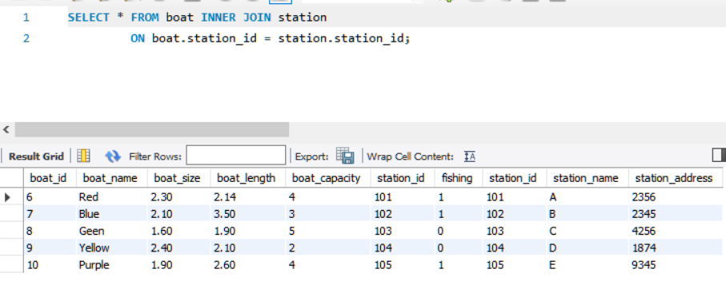

# FisheriesDB
A databse project for the fishing industry comprising of the following tables:

##### Station Table

##### Boat Table

##### Owners Table

##### Fishers Table

#### These tables can be joined as shown:
##### 1. Using station_id as the foreign key

##### 2. Using boat_id as the foeign key

### fs_main.py
Written in [Python 3.9](https://python.org) and [mysql](https://mysql.com) 
Libraries imported are **Mysql-connector** and **CSV**  
The following is the procedure followed in the code:
- Connect to mysql server.
- Create the database
- Create the tables
- Insert records into the tables from CSV files.
- Join the tables using a python function.

